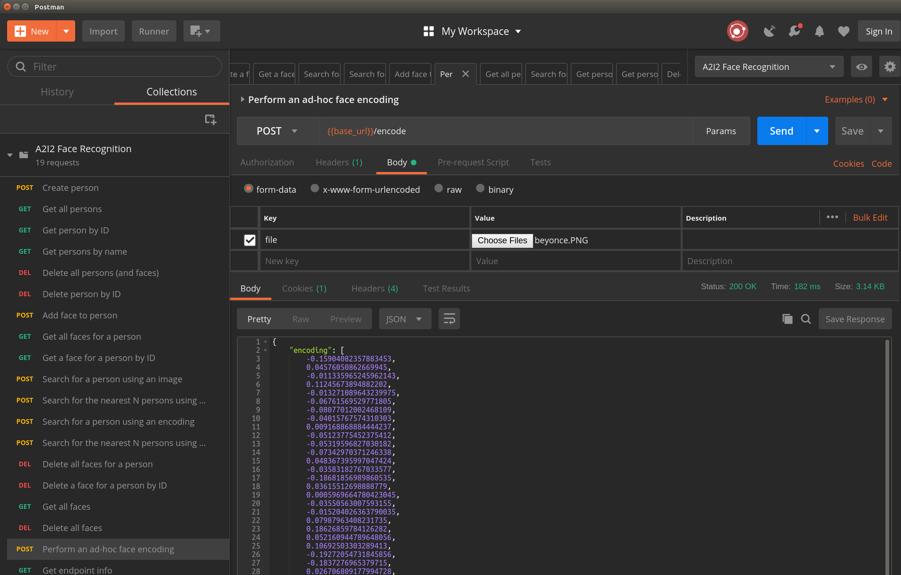

# A²I² Face Recognition Service

> An example project for Surround using face recognition models.

This project demonstrates how Surround can be used to build a facial recognition pipeline.

## Usage

For usage instructions, run `python3 -m face-recognition -h`.

### Summary

The pipeline can be run in two different modes: `server` and `batch`:
* `server` mode:
  - Usage: `python3 -m face-recognition server [-w]`
  - Description: Runs an HTTP server that provides REST endpoints for person/face registration and recognition. Additionally, the `-w`/`--webcam` flag can be used to run a TCP server alongside the HTTP server that will provide frames and face detection from a local webcam. NOTE: This currently only works on Linux. See the [Known Issues](#known-issues) section.
* `batch` mode:
  - Usage: `python3 -m face-recognition batch`
  - Description: Processes a directory of image files and produce an encoding for each one.

For detailed usage, supply `-h` to each subcommand.

### Server mode

#### Endpoints

To view a list of endpoints, visit the `/info` endpoint. A summarised list is as follows:

  * `POST /persons`: Create a person
  * `GET /persons`: Get all persons
  * `GET /persons?name=name`: Search for a person by name
  * `GET /persons/:id`: Get a single person by ID
  * `GET /persons/:id/faces`: Get all face encodings for a person
  * `POST /persons/:id/faces`: Add a face to a person
  * `GET /persons/:id/faces/:id`: Get a single face for a person by ID
  * `DELETE /persons/:id/faces/:id`: Delete a face for a person
  * `DELETE /persons/:id/faces`: Delete all faces for a person
  * `DELETE /persons`: Delete all persons
  * `DELETE /persons/:id`: Delete a person by ID
  * `POST /persons/photo-search`: Search for a person using a photo
  * `POST /persons/photo-search?nearest=N`: Get a list of the nearest people (in order of confidence) using a photo, up to a maximum of N people
  * `POST /persons/encoding-search`: Search for a person using an encoding
  * `POST /persons/encoding-search?nearest=N`: Get a list of the nearest people (in order of confidence) using a photo, up to a maximum of N people
  * `GET /faces`: Get all face encodings
  * `DELETE /faces`: Delete all face encodings
  * `POST /encode`: Perform a once-off encoding (don't save anything)"

#### Postman collection

An easy way to test the endpoints is to import the [Postman](https://www.getpostman.com/) collection and environment from the `postman` folder.



### Batch mode

Batch mode can be used to encode a directory of images and produce an encoding for each one. To test, run the following:

```
python3 -m face-recognition -i data/input -o data/output -c face-recognition/config.yaml
```

Then, check the `data/output` directory for encoding output.

## Docker image

This project is available as a Docker image, which can be run via the following command (As above, supply `server` or `batch` to choose the operating mode):

```
docker run dstilab/face-recognition
```

Running in `server` mode requires a PostgreSQL server to store registered people/faces. The easiest way to do this is to run via docker-compose:

```
docker-compose up
```

## Known issues

1. The webcam feed only works on Linux because [extra steps](https://stackoverflow.com/questions/41023827/accessing-usb-webcam-hosted-on-os-x-from-a-docker-container) are required to share a webcam with Docker on OSX/Windows hosts.
