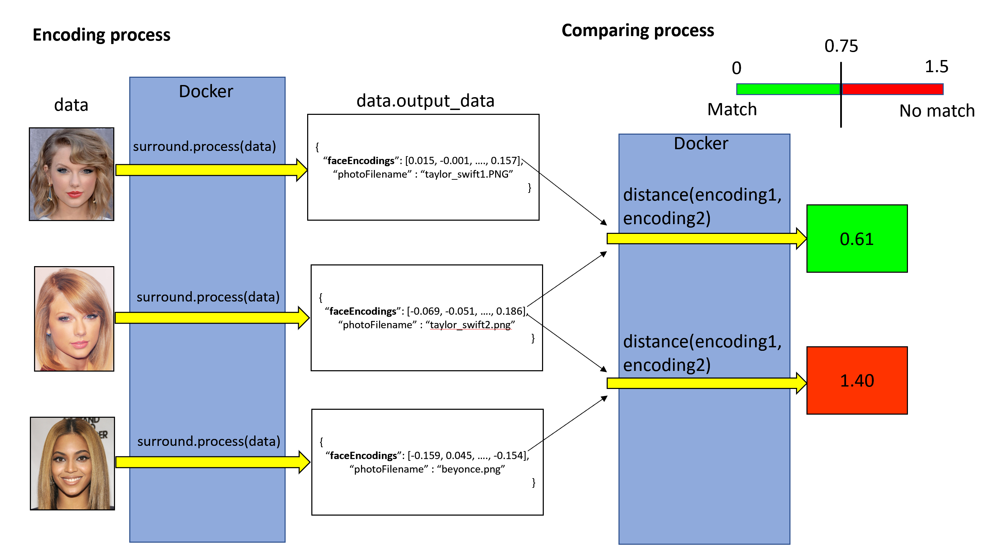

# face-recognition

An example project for Surround using face recognition models. The pipeline we propose is capable of generating unique encodings for face image. This encoding is then used to compare the similarity of 2 faces by calculating the euclidean distance between 2 encodings. If the distance is less than 0.75, 2 encodings are relatively closed and the 2 faces they these encodings represent are considered as matched.

## Machine learning framework

[Surround](https://github.com/dstil/surround), a framework for serving machine learning pipeline is used, each image data is put through 8 stages which represents different image transformation. The output of this process is either error messages or valid encodings.

## Dependencies
* Docker 18.03.0-ce

## Running web server

The webserver can handle POST request with image data and return encodings or error messages. It also handle POST request with 2 encodings and calculate distance between them. The server side script is at `src/main/python/flask_server.py`

* Clone this repository
* Open docker
* Navigate to root directory
* Run `./face-encoder-shell`
* When the server has started, run the website on `http://192.168.99.100/`

More information available on [this blog post](https://github.com/DungLai/face-recognition/blob/master/docs/blog.pdf)